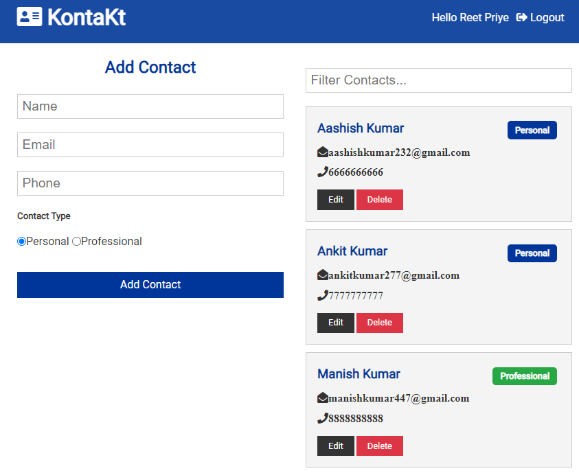

# KontaKt

**Save your important contacts on the cloud**

KontaKt is a simple, cloud-based contact management application. It allows users to store and manage their contacts securely and access them anytime from anywhere.

---

## 🚀 **Features**

- **Cloud-based contact storage:** Never lose your contacts again.
- **Secure authentication:** Uses JWT for secure access.
- **CRUD functionality:** Create, read, update, and delete your contacts.
- **Responsive design:** Optimized for both desktop and mobile devices.

---

## 🌐 **Live Demo**

Check out the live application at: [kontaktify.herokuapp.com](https://kontaktify.herokuapp.com/)

---

## 🛠️ **Tech Stack**

- **Frontend:**
  - React.js
  - CSS
- **Backend:**
  - Node.js
  - Express.js
- **Database:**
  - MongoDB
- **Authentication:**
  - JSON Web Tokens (JWT)

---

## ⚙️ **Setup Instructions**

### Prerequisites:

- Node.js installed on your machine.
- MongoDB instance running locally or remotely.
- A Heroku account (if deploying).

### Steps to Run Locally:

1. Clone the repository:

   ```bash
   git clone https://github.com/reetpriye/kontakt.git
   cd kontakt
   ```

2. Install dependencies:

   ```bash
   npm install
   ```

3. Set up environment variables:
   Create a `.env` file in the root directory with the following:

   ```
   MONGO_URI=your_mongodb_connection_string
   JWT_SECRET=your_jwt_secret
   ```

4. Run the server:

   ```bash
   npm start
   ```

5. Open the application in your browser:
   Navigate to `http://localhost:3000`.

---

## 📦 **Project Structure**

```plaintext
kontakt/
├── assets/         # Images and static assets
├── client/         # Frontend React code
├── config/         # Configuration files for database and environment
├── middleware/     # Middleware for authentication and error handling
├── models/         # MongoDB schemas and models
├── routes/         # API route definitions
├── server.js       # Entry point for the backend server
└── readme.md       # Project documentation
```

---

## 🔒 **Environment Variables**

The application requires the following environment variables:

- `MONGO_URI` - MongoDB connection string
- `JWT_SECRET` - Secret key for JWT tokens

---

## 🧪 **Testing**

Run the following command to test the application:

```bash
npm test
```
